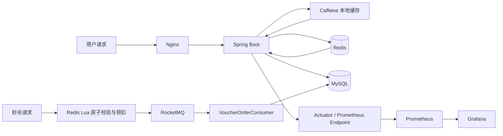
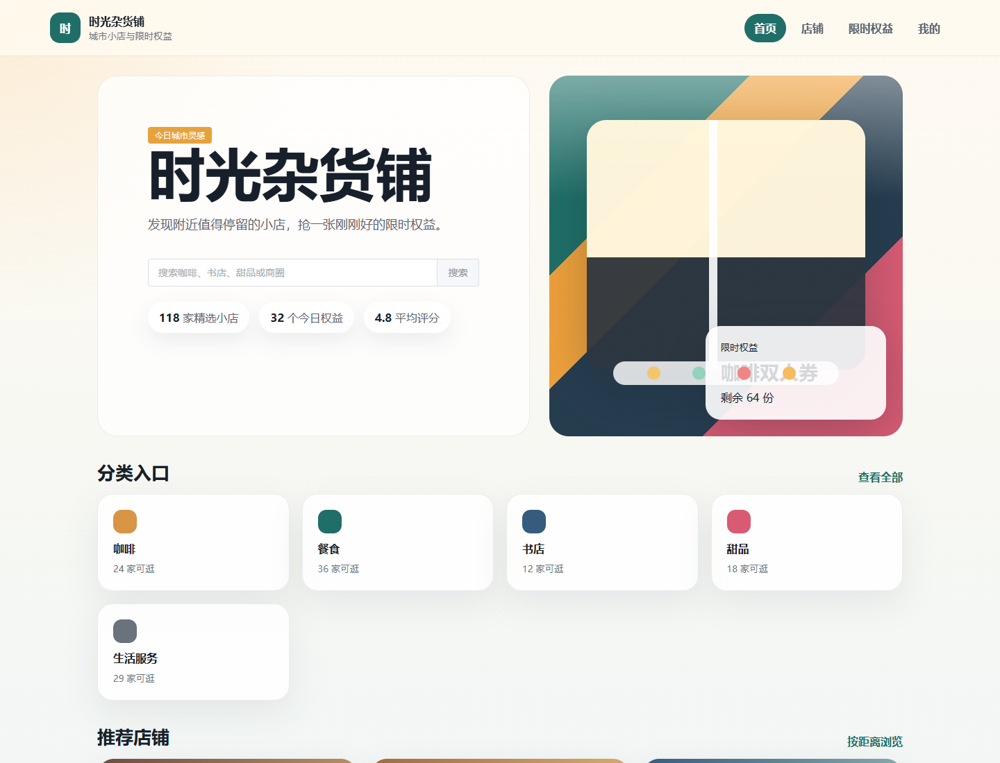
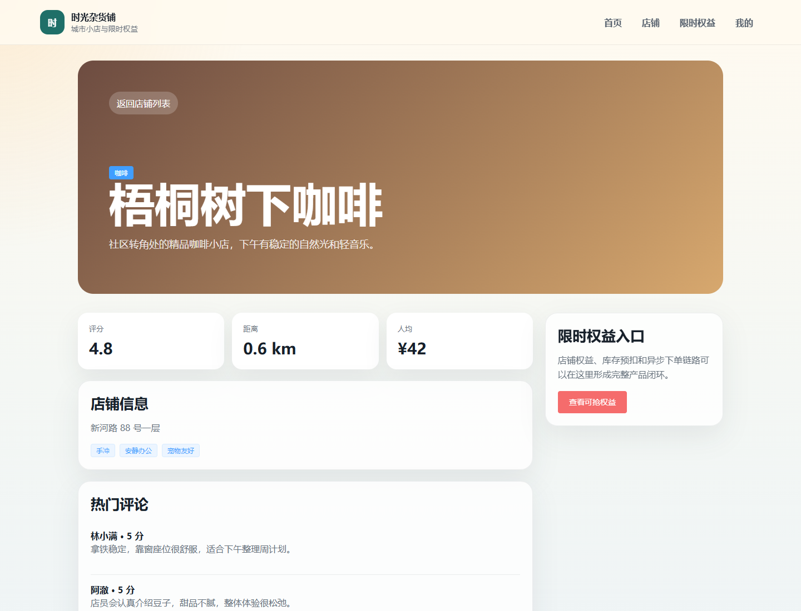
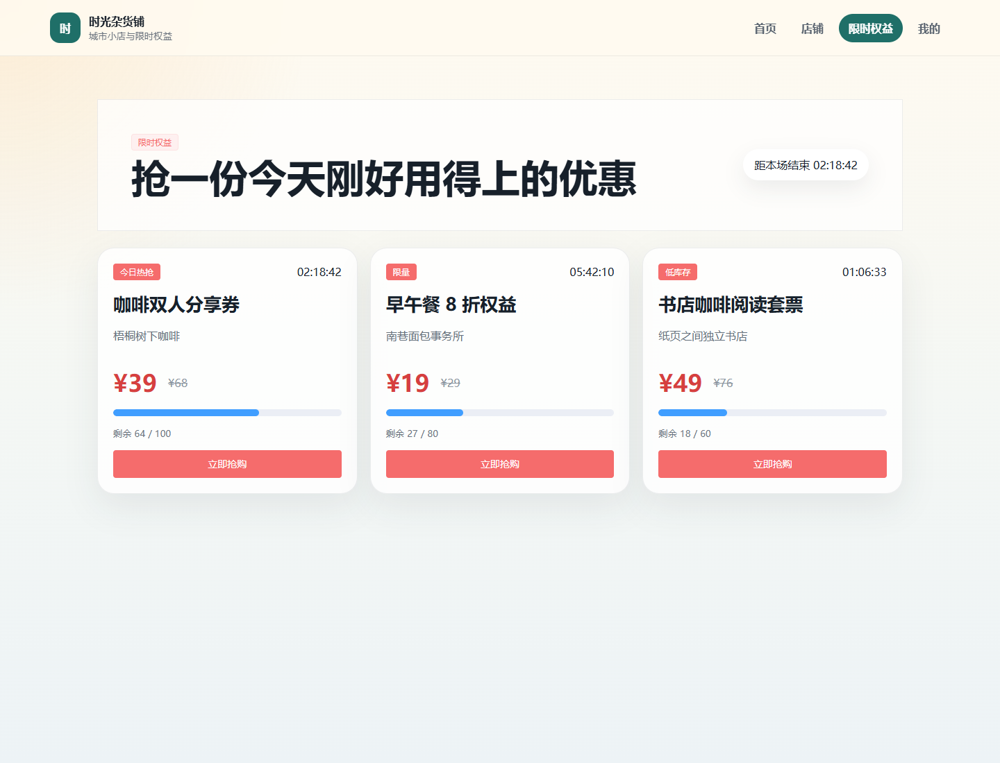
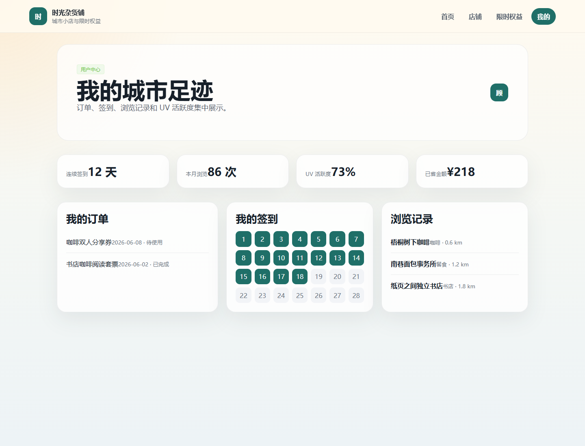

# 时光杂货铺

时光杂货铺是一个基于 Spring Boot 的城市小店探店与限时权益平台。项目围绕店铺浏览、附近推荐、限时抢购、异步下单、多级缓存和系统监控展开，适合作为 Java 后端高并发与全栈展示项目。

仓库在原有点评/秒杀业务基础上补充了消费端 Vue 页面、RocketMQ 异步下单链路、Caffeine + Redis 多级缓存观测、Prometheus + Grafana 监控和 JMeter/Node 压测脚本。前端当前使用 Mock 数据，重点用于 GitHub、简历和项目答辩中的产品化展示。

## 技术栈

**后端**

- Spring Boot 2.3
- MyBatis-Plus
- MySQL
- Redis
- Caffeine
- RocketMQ
- Lua
- JWT
- Nginx

**前端**

- Vue3
- Vite
- Element Plus

**监控与压测**

- Prometheus
- Grafana
- JMeter
- Node.js 压测脚本

## 核心功能

- 用户登录与认证
- 店铺查询与详情浏览
- 附近店铺推荐
- 限时权益抢购
- Redis Lua 原子库存预扣
- RocketMQ 异步下单
- 消费端幂等与失败回滚
- Caffeine + Redis 多级缓存
- Bitmap 签到
- HyperLogLog UV 统计
- Prometheus + Grafana 监控
- JMeter/脚本压测验证

## 前端展示

新增 `frontend` 目录提供消费端页面，不做传统后台管理系统，不堆 CRUD 表格。

- 首页：项目名、搜索框、分类入口、推荐店铺、限时权益活动区
- 店铺列表页：店铺卡片、距离、评分、人均消费、标签、距离/热度排序 UI
- 店铺详情页：店铺基础信息、地址、距离、评分、热门评论、限时权益入口
- 限时权益抢购页：权益卡片、库存进度条、倒计时、抢购按钮、结果提示
- 用户中心页：我的订单、我的签到、浏览记录、UV/活跃度展示卡片

## 系统架构



## 秒杀链路说明

秒杀请求进入后，系统先执行 `seckill.lua`。Lua 脚本在 Redis 内完成库存检查、一人一单校验、库存预扣和用户占位，避免并发请求在 Java 层拆分多个 Redis 操作导致竞态。

Redis 预扣成功后，请求线程生成订单号并投递 RocketMQ 消息。下单链路由 `VoucherOrderConsumer` 异步消费，最终写入 MySQL 并进行数据库库存扣减。这样可以缩短用户请求线程的阻塞时间，把高并发入口压力从 MySQL 前移到 Redis 和 MQ。

一致性保护包括：

- Redis Lua 保证库存预扣与一人一单校验的原子性
- RocketMQ 解耦请求入口与真实下单链路
- MySQL 使用 `stock > 0` 条件进行乐观扣减
- 订单表唯一索引防止重复下单
- Consumer 侧幂等处理消息重复消费
- MQ 投递失败时执行 `seckill_rollback.lua` 回滚 Redis 预扣库存和用户占位

更多说明见 [docs/seckill-design.md](docs/seckill-design.md)。

## 多级缓存说明

店铺详情属于高频读场景，系统使用 Caffeine + Redis 的多级缓存设计：

- Caffeine 承接单机热点访问，降低 Redis 往返开销
- Redis 作为分布式缓存，保证多实例间热点数据可共享
- 主动失效在店铺更新时删除本地缓存和 Redis 缓存
- 逻辑过期用于降低缓存击穿风险
- 通过 Micrometer / Prometheus 观察 Caffeine 命中率、接口耗时和请求量

更多说明见 [docs/cache-design.md](docs/cache-design.md)。

## 压测结果

当前仓库保留压测脚本和结果记录模板，真实性能数据请在本机或目标环境完成压测后填写。

| 场景 | 指标 | 结果 |
| --- | --- | --- |
| 商户详情接口 | 改造前 QPS | xxx |
| 商户详情接口 | 改造后 QPS | xxx |
| 商户详情接口 | 提升比例 | 约 26.1% |
| 秒杀链路 | 超卖 | 0 |
| 秒杀链路 | 重复下单 | 0 |

更多记录模板见 [docs/benchmark.md](docs/benchmark.md)。

## 页面截图

以下截图由前端 Mock 数据页面生成，适合放在 GitHub README 和简历项目说明中。

### 首页



### 店铺详情页



### 限时权益页



### 用户中心页



Grafana 监控页建议在完成真实压测后补充为 `screenshots/grafana.png`。

截图目录说明见 [screenshots/README.md](screenshots/README.md)。

## 快速启动

### 1. 准备基础服务

项目默认依赖：

- MySQL：`127.0.0.1:3306`
- Redis：`localhost:6379`
- RocketMQ：`127.0.0.1:9876`
- Prometheus：`localhost:9090`
- Grafana：`localhost:3000`

RocketMQ、Prometheus 和 Grafana 可通过 Docker Compose 启动：

```bash
docker compose up -d
```

入口地址：

- RocketMQ Dashboard: <http://localhost:8090>
- Prometheus: <http://localhost:9090>
- Grafana: <http://localhost:3000>

Grafana 默认账号密码：

```text
admin / admin
```

### 2. 初始化 MySQL

创建 `hmdp` 数据库后执行：

```sql
source src/main/resources/db/hmdp.sql;
```

如需覆盖本机配置，可创建不会提交的本地配置文件：

```text
src/main/resources/application-local.yaml
```

示例：

```yaml
spring:
  datasource:
    password: your_mysql_password
```

### 3. 启动后端

本项目是 Java 8 / Spring Boot 2.3 项目，请使用 JDK 8 运行 Maven。

```powershell
$env:JAVA_HOME = 'E:\Users\Administrator\.jdks\corretto-1.8.0_492'
& 'C:\Users\Administrator\.m2\wrapper\dists\apache-maven-3.9.15-bin\4rlcemksed9vjmkvgss0jpc4po\apache-maven-3.9.15\bin\mvn.cmd' spring-boot:run
```

默认后端地址：

```text
http://localhost:8081
```

健康检查：

```text
http://localhost:8081/actuator/health
http://localhost:8081/actuator/prometheus
```

### 4. 启动前端

```bash
cd frontend
npm install
npm run dev
```

默认前端地址：

```text
http://localhost:5173
```

前端当前使用 Mock 数据即可独立展示；如后续接入真实接口，可通过 `frontend/vite.config.js` 中的 `/api` 代理访问 Spring Boot。

## 压测脚本

商户详情接口压测：

```bash
node scripts/shop-cache-benchmark.mjs --shopId 1 --total 1000 --concurrency 100
```

秒杀链路压测：

```bash
node scripts/seckill-load-test.mjs --voucherId 16 --total 1000 --concurrency 100
```

如果通过 Nginx 访问，秒杀接口通常为：

```text
POST http://127.0.0.1:8080/api/voucher-order/seckill/{voucherId}
```

如果直接访问 Spring Boot：

```text
POST http://127.0.0.1:8081/voucher-order/seckill/{voucherId}
```

## 文档索引

- [系统架构](docs/architecture.md)
- [秒杀设计](docs/seckill-design.md)
- [多级缓存设计](docs/cache-design.md)
- [压测记录](docs/benchmark.md)
- [截图说明](screenshots/README.md)
