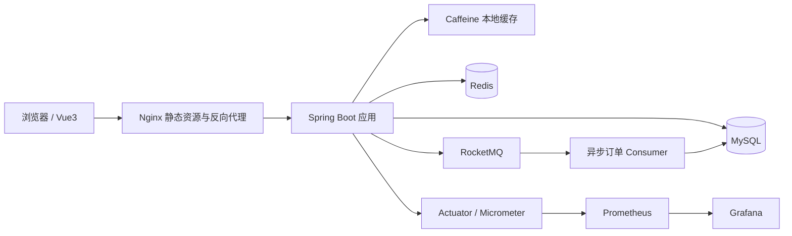

# 系统架构

时光杂货铺采用前后端分离的展示结构。后端负责用户、店铺、优惠券、订单、签到、UV 统计和监控指标；前端负责消费端页面展示，并可通过 Vite 代理访问后端接口。

## 总体架构

## 请求链路

普通浏览和查询请求优先命中 Caffeine 本地缓存，其次访问 Redis，最后回源 MySQL。热点数据通过多级缓存降低数据库压力，店铺更新时主动删除缓存，避免长时间读取旧数据。

秒杀请求先进入 Redis Lua 脚本，由 Redis 完成库存预扣与一人一单校验。通过校验后再投递 RocketMQ，由 Consumer 异步创建订单并扣减 MySQL 库存。

## 部署视角

- Vue3 前端可由 Vite 本地启动，也可构建后交给 Nginx 托管。
- Spring Boot 默认运行在 `8081`。
- Nginx 可将 `/api` 反向代理到 Spring Boot。
- RocketMQ、Prometheus、Grafana 可通过 `docker-compose.yml` 启动。
- MySQL 和 Redis 使用本机或外部服务，配置项位于 `src/main/resources/application.yaml`。

## 可观测性

Spring Boot Actuator 暴露健康检查、JVM 指标、HTTP 指标和 Prometheus 指标。Prometheus 定时抓取 `/actuator/prometheus`，Grafana 通过 Prometheus 数据源展示接口延迟、请求量、JVM、CPU 和缓存命中率。
