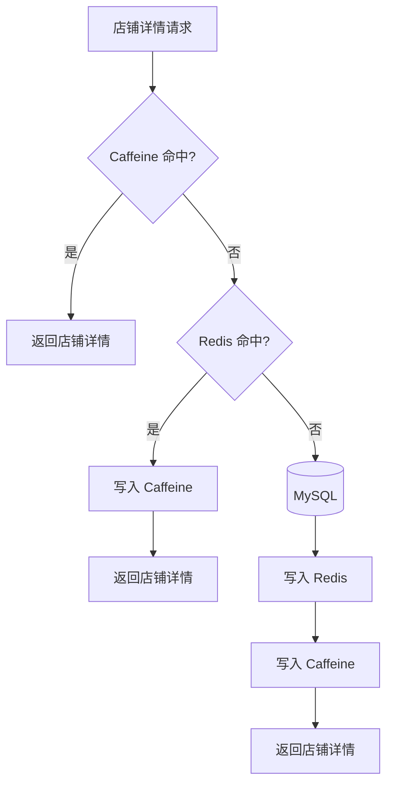

# 多级缓存设计

店铺详情是典型的高频读接口。时光杂货铺使用 Caffeine + Redis + MySQL 的多级缓存结构，让热点请求尽量在靠近应用的地方被消化。

## 读取流程



## Caffeine 本地缓存

Caffeine 位于应用进程内，适合承接单机热点访问。它的优势是延迟低、没有网络往返，适合店铺详情这类读多写少的数据。

需要注意的是，本地缓存只在当前应用实例内生效。多实例部署时，仍需要 Redis 作为共享缓存，并配合主动失效策略避免长时间读取旧值。

## Redis 分布式缓存

Redis 作为多实例共享缓存，承接跨应用节点的热点数据。缓存 Key 建议保持稳定、可读，例如：

```text
cache:shop:{shopId}
```

在店铺数据变更时，应主动删除 Redis 与 Caffeine 中的对应缓存。删除失败时可以通过过期时间兜底。

## 逻辑过期与击穿保护

对于高热店铺，可以使用逻辑过期保存旧值和逻辑过期时间。请求发现数据逻辑过期后，先返回旧值，再由后台线程异步重建缓存。

这种方式可以降低热点 Key 失效瞬间大量请求回源 MySQL 的风险。

## 监控指标

通过 Micrometer 和 Prometheus 观察：

- Caffeine 命中次数
- Caffeine 未命中次数
- 本地缓存命中率
- 店铺详情接口 QPS
- 店铺详情接口 p95 / p99 延迟
- Redis 延迟与连接池状态

压测报告中不要填写估算数据，应使用脚本或 JMeter 在固定环境下重复测试后记录。
