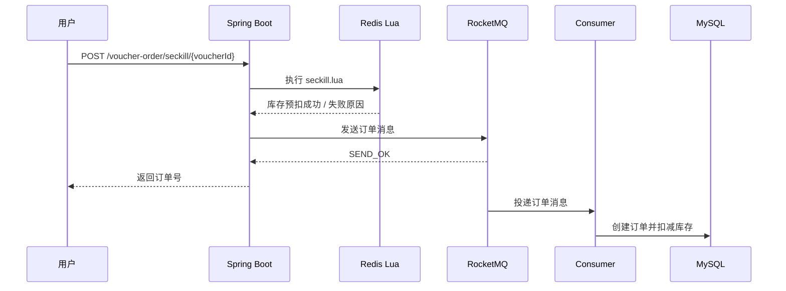

# 秒杀设计

限时权益抢购链路的目标是减少高并发请求对 MySQL 的直接冲击，同时保证不超卖、不重复下单，并在失败场景下保留补偿能力。

## 核心流程

## Redis Lua 原子预扣

`seckill.lua` 在 Redis 内部完成三个动作：

1. 判断 `seckill:stock:{voucherId}` 是否有库存。
2. 判断 `seckill:order:{voucherId}` 是否已经包含当前用户。
3. 扣减 Redis 库存并记录用户占位。

Lua 脚本在 Redis 单线程执行模型下具备原子性，避免 Java 层多次 Redis 调用之间被其他请求插入。

## RocketMQ 异步下单

Redis 校验成功后，请求线程只负责生成订单号并发送 MQ 消息。真正的订单写入由 `VoucherOrderConsumer` 执行，降低用户请求线程的数据库写入压力。

异步化收益：

- 缩短接口响应路径。
- 将流量峰值削入 MQ。
- 方便后续扩展重试、死信、补偿和监控。

## MySQL 最终保护

Consumer 写库时保留数据库层面的保护：

- 使用唯一索引防止同一用户重复购买同一权益。
- 使用 `stock > 0` 条件扣减，避免数据库层超卖。
- 捕获重复下单异常并进行幂等处理。

Redis 预扣负责入口削峰，MySQL 负责最终一致性边界。

## 幂等与回滚

消息可能重复投递或重复消费，因此 Consumer 需要根据用户 ID 和权益 ID 做幂等判断。对于已经存在的订单，直接返回成功，不再次扣减库存。

如果 MQ 发送失败，入口线程执行 `seckill_rollback.lua`：

- 回补 Redis 预扣库存。
- 移除用户占位。
- 返回系统繁忙提示，允许用户稍后重试。

如果 Consumer 执行过程中出现不可恢复失败，建议在真实生产环境增加死信队列、补偿任务和人工巡检报表。

## 压测验证指标

建议压测时记录：

- 总请求数：xxx
- 并发数：xxx
- 成功下单数：xxx
- 业务失败数：xxx
- HTTP/网络失败数：xxx
- p95 延迟：xxx ms
- p99 延迟：xxx ms
- 超卖数量：0
- 重复下单数量：0
